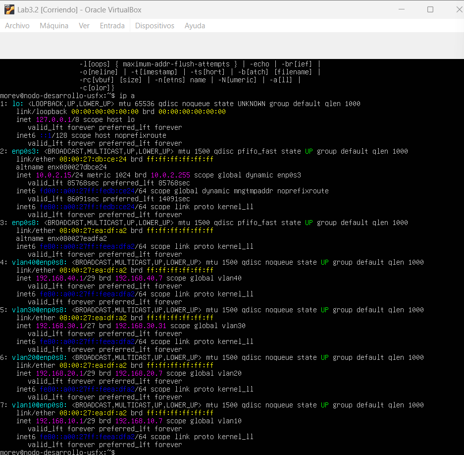
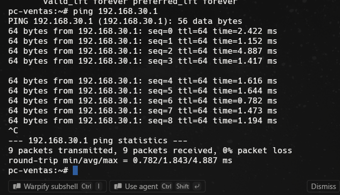
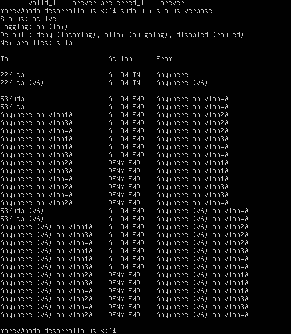

# Informe de Laboratorio 3.2: Infraestructura de Red de una Organización con VLANs

**Universidad San Francisco Xavier de Chuquisaca**  
**Carrera:** Ingeniería en Ciencias de la Computación  
**Asignatura:** Infraestructura, Plataformas Tecnológicas y Redes (SIS313)  
**Docente:** Ing. Franz Villalpando  
**Semestre:** 2/2026  

---

### Datos del Estudiante / Grupo Lab 2
  - Moreno Montero Victor Ruben -
- **Fecha de Entrega:** 30/09/26

---

## 1. Resumen 

En el presente laboratorio se diseñó e implementó una arquitectura de red empresarial segmentada mediante **VLANs (IEEE 802.1Q)** utilizando un entorno de virtualización en VirtualBox. La red está compuesta por un Router central sobre **Ubuntu Server 24.04** encargado del enrutamiento inter-VLAN y la gestión de la seguridad, junto con cuatro segmentos funcionales (DMZ, TI, Ventas y Contabilidad) desplegados con instancias de **Alpine Linux**.

Mediante el uso de herramientas como Netplan, `8021q` y **UFW (Uncomplicated Firewall)**, se configuraron políticas estrictas de control de tráfico para garantizar la segregación de departamentos, restringir el acceso a la red DMZ y habilitar la salida a Internet solo para las áreas autorizadas (TI y Contabilidad) mediante NAT/Masquerade.

---

## 2. Arquitectura y Esquema de Red

### 2.1 Tabla de Direccionamiento IP y Segmentación

| Máquina Virtual | Departamento / Rol | VLAN ID | Subred / Máscara | Dirección IP | Gateway |
| :--- | :--- | :---: | :--- | :--- | :--- |
| `Router` | Router / Firewall | - | Varias | `192.168.10.1` <br> `192.168.20.1` <br> `192.168.30.1` <br> `192.168.40.1` | N/A (Interfaz NAT) |
| `Server-DMZ1` | Servidor DMZ 1 | 10 | `192.168.10.0/29` | `192.168.10.2/29` | `192.168.10.1` |
| `Server-DMZ2` | Servidor DMZ 2 | 10 | `192.168.10.0/29` | `192.168.10.3/29` | `192.168.10.1` |
| `PC-TI` | Tecnología de la Información | 20 | `192.168.20.0/29` | `192.168.20.2/29` | `192.168.20.1` |
| `PC-Ventas` | Área de Ventas | 30 | `192.168.30.0/27` | `192.168.30.2/27` | `192.168.30.1` |
| `PC-Contabilidad` | Área de Contabilidad | 40 | `192.168.40.0/29` | `192.168.40.2/29` | `192.168.40.1` |

### 2.2 Matriz de Políticas de Acceso (Firewall)

| Origen \ Destino | DMZ (VLAN 10) | TI (VLAN 20) | Ventas (VLAN 30) | Contabilidad (VLAN 40) | Internet |
| :--- | :---: | :---: | :---: | :---: | :---: |
| **DMZ (VLAN 10)** | - | ❌ Denegado | ❌ Denegado | ❌ Denegado | ❌ Denegado |
| **TI (VLAN 20)** | Permitido | - | Permitido | Permitido | Permitido |
| **Ventas (VLAN 30)** | Permitido | ❌ Denegado | - | ❌ Denegado | ❌ Denegado |
| **Contabilidad (VLAN 40)** | Permitido | ❌ Denegado | Permitido | - | Permitido |

---

## 3. Desarrollo Experimental y Configuración

### Paso 1: Configuración del Router (Ubuntu Server)

1. **Instalación de paquetes necesarios y habilitación del módulo de VLAN:**
   ```bash
   sudo apt update && sudo apt install -y vlan ufw
   sudo modprobe 8021q
   echo "8021q" | sudo tee -a /etc/modules
   ```

2. **Configuración de Netplan (`/etc/netplan/50-cloud-init.yaml`):**
   Se configuró la interfaz `enp0s3` para el enlace WAN (NAT) y la interfaz `enp0s8` como enlace *Trunk* para las sub-interfaces VLAN:

   ```yaml
   network:
     version: 2
     ethernets:
       enp0s3:
         dhcp4: true
       enp0s8:
         dhcp4: no
         optional: true
     vlans:
       vlan10:
         link: enp0s8
         id: 10
         addresses:
           - 192.168.10.1/29
         nameservers:
           addresses: [8.8.8.8]
       vlan20:
         link: enp0s8
         id: 20
         addresses:
           - 192.168.20.1/29
         nameservers:
           addresses: [8.8.8.8]
       vlan30:
         link: enp0s8
         id: 30
         addresses:
           - 192.168.30.1/27
         nameservers:
           addresses: [8.8.8.8]
       vlan40:
         link: enp0s8
         id: 40
         addresses:
           - 192.168.40.1/29
         nameservers:
           addresses: [8.8.8.8]
   ```

   Aplicación de la configuración:
   ```bash
   sudo netplan apply
   ```

3. **Habilitación del Reenvío de Paquetes (IP Forwarding):**
   Se modificó el archivo `/etc/sysctl.conf` descomentando la línea:
   ```text
   net.ipv4.ip_forward=1
   ```
   Y se aplicaron los cambios con:
   ```bash
   sudo sysctl -p
   ```

 

---

### Paso 2: Configuración de Clientes (Alpine Linux)

En cada máquina cliente con Alpine Linux se instaló la utilidad `vlan` y se configuró la red mediante el archivo `/etc/network/interfaces`.

#### A. PC Contabilidad (`eth0.40`)
```text
auto lo
iface lo inet loopback

auto eth0.40
iface eth0.40 inet static
    address 192.168.40.2
    netmask 255.255.255.248
    gateway 192.168.40.1
    vlan-id 40

auto eth0
iface eth0 inet manual
    up ip link set $IFACE up
    down ip link set $IFACE down
```

#### B. PC Ventas (`eth0.30`)
```text
auto lo
iface lo inet loopback

auto eth0.30
iface eth0.30 inet static
    address 192.168.30.2
    netmask 255.255.255.224
    gateway 192.168.30.1
    vlan-id 30

auto eth0
iface eth0 inet manual
    up ip link set $IFACE up
    down ip link set $IFACE down
```

#### C. PC TI (`eth0.20`)
```text
auto lo
iface lo inet loopback

auto eth0.20
iface eth0.20 inet static
    address 192.168.20.2
    netmask 255.255.255.248
    gateway 192.168.20.1
    vlan-id 20

auto eth0
iface eth0 inet manual
    up ip link set $IFACE up
    down ip link set $IFACE down
```

#### D. Server DMZ 1 (`eth0.10`)
```text
auto lo
iface lo inet loopback

auto eth0.10
iface eth0.10 inet static
    address 192.168.10.2
    netmask 255.255.255.248
    gateway 192.168.10.1
    vlan-id 10

auto eth0
iface eth0 inet manual
    up ip link set $IFACE up
    down ip link set $IFACE down
```

> ** Captura de Pantalla sugerida:** Comprobación de conectividad básica (`ping 192.168.x.1`) desde una de las máquinas cliente hacia su correspondiente gateway.  
> 

---

### Paso 3: Configuración de Políticas de Seguridad con UFW y NAT

#### A. Configuración de Reglas de Enrutamiento en UFW
Se establecieron las reglas en el Router para controlar el paso de tramas entre las interfaces virtuales:

```bash
# Habilitar SSH local
sudo ufw allow ssh

# Reglas para TI (VLAN 20) -> Acceso Total
sudo ufw route allow in on vlan20 out on vlan10
sudo ufw route allow in on vlan20 out on vlan30
sudo ufw route allow in on vlan20 out on vlan40

# Reglas para Ventas (VLAN 30) -> Solo DMZ
sudo ufw route allow in on vlan30 out on vlan10

# Reglas para Contabilidad (VLAN 40) -> DMZ y Ventas
sudo ufw route allow in on vlan40 out on vlan10
sudo ufw route allow in on vlan40 out on vlan30

# Denegaciones explícitas desde DMZ (VLAN 10) hacia la red interna
sudo ufw route deny in on vlan10 out on vlan20
sudo ufw route deny in on vlan10 out on vlan30
sudo ufw route deny in on vlan10 out on vlan40

# Denegaciones explícitas desde Ventas (VLAN 30)
sudo ufw route deny in on vlan30 out on vlan20
sudo ufw route deny in on vlan30 out on vlan40

# Denegaciones explícitas desde Contabilidad (VLAN 40)
sudo ufw route deny in on vlan40 out on vlan20

# Activar Firewall
sudo ufw enable
```

#### B. Configuración de NAT / Masquerade (Acceso a Internet)
Se editó el archivo `/etc/ufw/before.rules` agregando el bloque NAT al inicio del archivo para dar salida a Internet únicamente a la VLAN 20 (TI) y VLAN 40 (Contabilidad):

```text
*nat
:POSTROUTING ACCEPT [0:0]
-A POSTROUTING -s 192.168.20.0/29 -o enp0s3 -j MASQUERADE
-A POSTROUTING -s 192.168.40.0/29 -o enp0s3 -j MASQUERADE
COMMIT
```

Se reinició UFW para cargar los cambios:
```bash
sudo ufw reload
```

 
> 

---

## 4. Pruebas de Conectividad y Verificación de Políticas

Para validar la correcta implementación del laboratorio, se realizaron las siguientes pruebas sistemáticas desde cada departamento:

### 4.1 Pruebas de Acceso a Internet (NAT)

| Origen | Comando Ejecutado | Resultado Esperado | Resultado Obtenido | Estado |
| :--- | :--- | :---: | :---: | :---: |
| **PC TI** (`192.168.20.2`) | `ping -c 3 8.8.8.8` | Exitoso | 0% packet loss | PASÓ |
| **PC Contabilidad** (`192.168.40.2`) | `ping -c 3 8.8.8.8` | Exitoso | 0% packet loss | PASÓ |
| **PC Ventas** (`192.168.30.2`) | `ping -c 3 8.8.8.8` | Fallido | 100% packet loss / Destination Host Unreachable | PASÓ |
| **Server DMZ** (`192.168.10.2`) | `ping -c 3 8.8.8.8` | Fallido | 100% packet loss | PASÓ |

> ** Captura de Pantalla sugerida:** Terminal dividida demostrando un `ping google.com` exitoso desde **Contabilidad** y un `ping 8.8.8.8` denegado/bloqueado desde **Ventas**.  
> 

---

### 4.2 Pruebas de Inter-VLAN Routing y Seguridad

1. **Desde PC Ventas (`192.168.30.2`):**
   - Intento de conexión SSH a PC Contabilidad (`192.168.40.2`):
     ```bash
     ssh admin@192.168.40.2
     ```
     **Resultado:** Connection timed out (Bloqueado exitosamente por UFW).
   - Ping a Servidor DMZ (`192.168.10.2`):
     ```bash
     ping -c 3 192.168.10.2
     ```
     **Resultado:** Exitoso (Permitido según política).

2. **Desde PC Contabilidad (`192.168.40.2`):**
   - Ping a PC TI (`192.168.20.2`): Bloqueado por UFW.
   - Ping a PC Ventas (`192.168.30.2`): Exitoso.

3. **Desde PC TI (`192.168.20.2`):**
   - Acceso a todas las subredes (`192.168.10.2`, `192.168.30.2`, `192.168.40.2`): Conexión exitosa a todas las VLANs.

4. **Desde Server DMZ (`192.168.10.2`):**
   - Intento de ping hacia cualquier VLAN interna (`192.168.20.2`, `192.168.30.2`, `192.168.40.2`): Totalmente bloqueado.

> ** Captura de Pantalla sugerida:** Capturas del cliente Ventas intentando acceder por SSH o Ping a la red de Contabilidad/TI mostrando el bloqueo de red.  
> 

---

## 5. Conclusiones y Recomendaciones

### Conclusiones
1. **Segregación Efectiva:** La implementación de VLANs bajo el estándar 802.1Q permitió aislar lógicamente los dominios de difusión de cada departamento sobre una misma infraestructura física/virtual.
2. **Control de Tráfico Granular:** El uso de UFW en el router Ubuntu ofreció una administración clara y precisa de las reglas de enrutamiento inter-VLAN, garantizando el principio de mínimo privilegio en el acceso a los recursos.
3. **Protección de la DMZ:** Se confirmó la correcta separación de la DMZ, impidiendo que una posible vulnerabilidad en los servidores expuestos afecte la red interna (TI, Ventas, Contabilidad).

### Recomendaciones
1. **Promiscuous Mode en el Hipervisor:** Asegurar que en VirtualBox la interfaz "Red Interna" mantenga el modo promiscuo configurado en *"Permitir Todo"* (*Allow All*) para asegurar que las tramas etiquetadas (VLAN tagged) no sean descartadas por la interfaz física simulada.
2. **Persistencia de Reglas:** En entornos de producción, es imprescindible verificar la persistencia de las reglas de `iptables`/`ufw` y el parámetro `ip_forward` ante eventuales reinicios del sistema.
