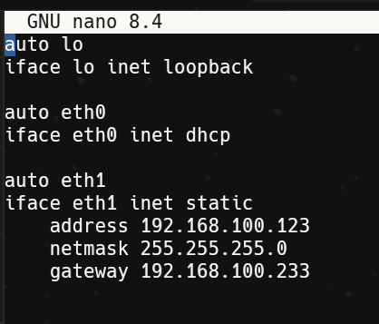
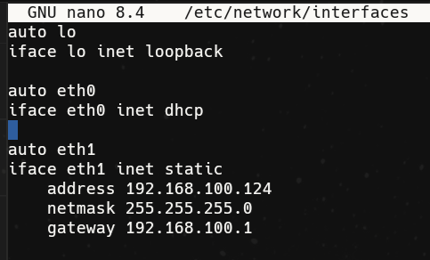
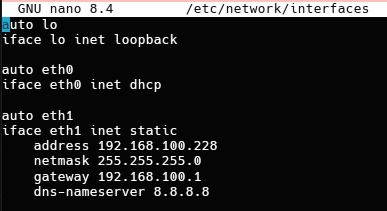
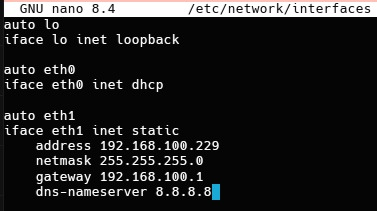
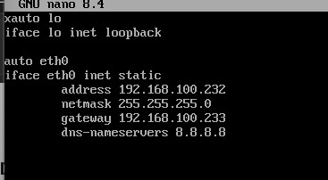
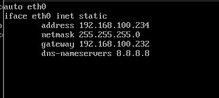

# LABORATORIO 3.1

## Proxy Inverso con Balanceador de Carga Avanzado y Servidores Web NGINX

**UNIVERSITARIO:**
- Vásquez Rivera Emily (SIS)
- Mendoza Sandoval Jery (SIS)
- Terceros Arcani Alejandra Verónica (CICO)
- Moreno Montero Victor Ruben (CICO)

**MATERIA:** SIS 313  
**DOCENTE:** Ing. Franz Villalpando  
**GRUPO:** 1/2  

**SUCRE - BOLIVIA**  
**2026**

---

# Configuración y Despliegue de Servidores Web (Alpine Linux)

## 1. Introducción

El objetivo de esta práctica fue la configuración de servidores web ligeros utilizando Alpine Linux, implementando un entorno de ejecución con PHP, Node.js y Python con un servidor NGINX actuando como Proxy Inverso. Se trabajó en la interconexión de estos servidores con un Proxy central para garantizar la salida a internet y el servicio de peticiones externas.

## 2. Configuración de Red del Host (Servidor Web)

Para que el servidor web pudiera comunicarse, se realizaron las siguientes configuraciones: 

### Identificación de Interfaces

Se configuró la interfaz `eth0` con el direccionamiento IP dentro del segmento de red en nuestro caso la red `192.168.100.0/24`.

### TABLA DE ASIGNACIÓN DE IPS


|  Máquina virtual | Dirección IP |  Puerto | Adapatadores |
| ------------ | ------------ | ------------ | ------------ |
| Proxy (Ububtu) | 192.168.100.233| Fila 1, Col 3|  NAT, Puente|
| Web Server 1| 192.168.100.122| |NAT, Puente|
| Web Server 2| 192.168.100.123| |NAT, Puente|
| Web Server 3| 192.168.100.232| |NAT, Puente|
| Web Server 4| 192.168.100.228| |NAT, Puente|
| Web Server 5| 192.168.100.229| |NAT, Puente|
| Web Server 6| 192.168.100.234| |NAT, Puente||

<div align="center">








  



</div>

### Enrutamiento

Se estableció en todos los servidores el Gateway apuntando a la IP del Proxy para permitir el tráfico fuera de la red local.

### Resolución de Nombres (DNS)

Se editó el archivo `/etc/resolv.conf` añadiendo el `nameserver 8.8.8.8`, solucionando errores de resolución de nombres.

## 3. Instalación y Configuración del Servidor Web

Se utilizó el gestor de paquetes `apk` para preparar el entorno:

### Instalación de Paquetes

```bash
apk add nginx nodejs npm curl
rc-update add nginx default
rc-service nginx start
rc-service nginx start
rc-service nginx status
```

### Despliegue de la Aplicación

Se creó un archivo `index.js` en Node.js que genera una interfaz dinámica (Glassmorphism) para mostrar el estado del servidor, su nombre y su dirección IP.

### Configuración de NGINX

Se modificó `/etc/nginx/http.d/default.conf` para redirigir el tráfico del puerto 80 al puerto 3000 (donde corre Node.js) mediante la directiva `proxy_pass`.

## 4. Gestión de Errores y Soluciones (Troubleshooting)

Esta fue la parte más técnica de la práctica, documentada mediante capturas de pantalla.

## 5. Pruebas de Funcionamiento

Se validó la correcta operación del servidor mediante herramientas locales y externas:

- **Comando `curl localhost`:** Verificación de que el servidor responde con el código HTML diseñado.
- **Validación de Hostname:** Cambio exitoso del nombre de host a `webserver4` y su reflejo en la interfaz web.

### Errores Encontrados y Soluciones

| Error Encontrado | Causa | Solución Aplicada |
|---|---|---|
| **502 Bad Gateway** | NGINX no encontraba el proceso de Node.js activo. | Se inició el proceso `node index.js &`. |
| **EADDRINUSE (Port 3000)** | El puerto ya estaba ocupado por una instancia previa de Node.js. | Uso de `pkill node` para liberar el puerto y reiniciar el servicio. |
| **404 Not Found** | NGINX intentaba buscar archivos físicos en lugar de usar el proxy inverso. | Corrección en el bloque `location /` del archivo de configuración de NGINX. |
| **Sesión cerrada en Warp** | Uso de `ip addr flush` en una sesión remota. | Configuración directa desde la consola de la máquina virtual. |

## 6. Conclusión

La práctica permitió comprender la importancia del flujo de red entre un Proxy y un Servidor Web. El uso de Alpine Linux demostró ser eficiente para entornos de servidores web, mientras que la implementación de NGINX como Proxy Inverso proporcionó una capa de abstracción necesaria para servir aplicaciones modernas de Node.js.

En la práctica: Nginx se situó "al frente" de Node.js. El cliente (tú con el comando `curl`) le pide cosas a Nginx en el puerto 80, y Nginx, de forma invisible, le pide la información a Node.js en el puerto 3000. Esto protege la aplicación de Node.js y permite gestionar mejor el tráfico.

El Proxy (Ubuntu) puede configurarse para que, cuando lleguen muchas visitas, reparta el trabajo: una petición para `webserver3` y la siguiente para `webserver4`.
